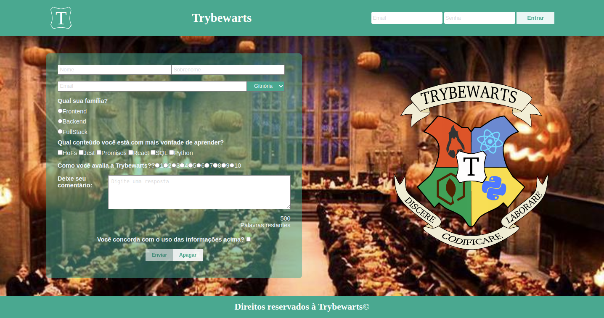

<!-- Olá, Tryber!
Esse é apenas um arquivo inicial para o README do seu projeto.
É essencial que você preencha esse documento por conta própria, ok?
Não deixe de usar nossas dicas de escrita de README de projetos, e deixe sua criatividade brilhar!
:warning: IMPORTANTE: você precisa deixar nítido:
- quais arquivos/pastas foram desenvolvidos por você; 
- quais arquivos/pastas foram desenvolvidos por outra pessoa estudante;
- quais arquivos/pastas foram desenvolvidos pela Trybe.
-->

# Projeto TrybeWarts
 
# Contexto
 
Neste projeto foi desenvolvido uma página com HTML, CSS e JavaScript, a pagina tem um formulario. de inscrição da Escola de Magia de Trybewarts, em que as pessoas estudantes poderão enviar seus feedbacks sobre ela. O tema desse projeto é baseado na obra 'Harry Potter', de J. K. Rowling.
#



[Acesse o site aqui.](https://hugodesousa.github.io/Project-TrybeWarts-Formulario/)

## Tecnologias usadas

Front-end:
> Desenvolvido com HTML, CSS e JavaScript.
 
#
## Executando aplicação
 
* Para o site direto no navegador:
 
 ```
  https://hugodesousa.github.io/Project-TrybeWarts-Formulario/ 
 ```
* Para rodar em uma máquina local
 
 ```
   No terminal rodar os comandos:
 ```
 ```
   git clone git@github.com:Hugodesousa/Project-TrybeWarts-Formulario.git
 ```
 ```
   cd Project-TrybeWarts-Formulario

 ```
 ```
   npm install
 ```
 ```
   Instalar a extensão: https://marketplace.visualstudio.com/items?itemName=ritwickdey.LiveServer
 ```
 ```
   Iniciar a página pelo botão "Go live"
 ```
#
### Projeto base fornecido pela Trybe
https://www.betrybe.com/
